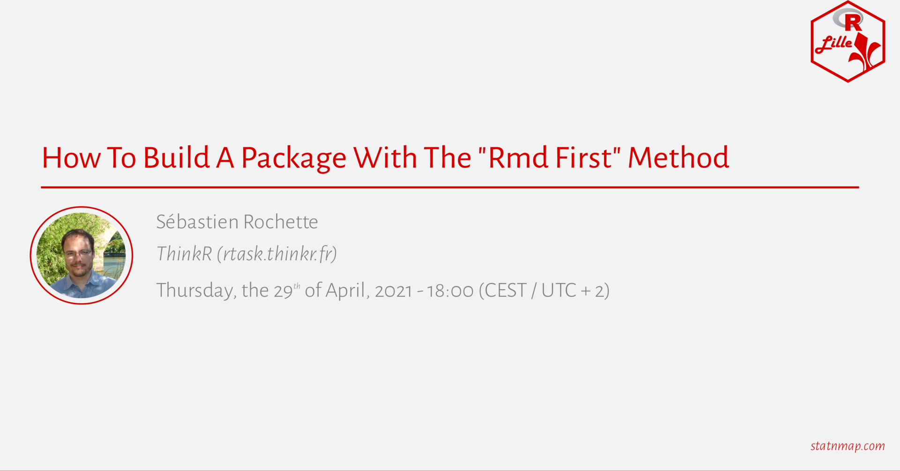
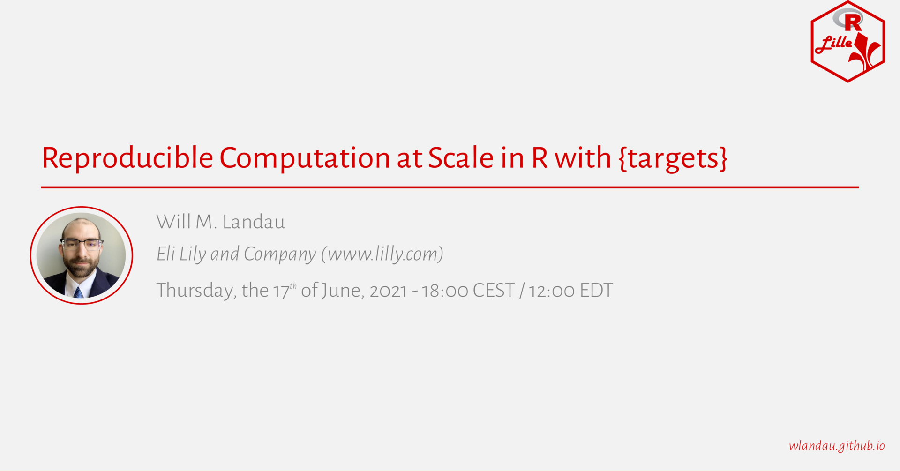
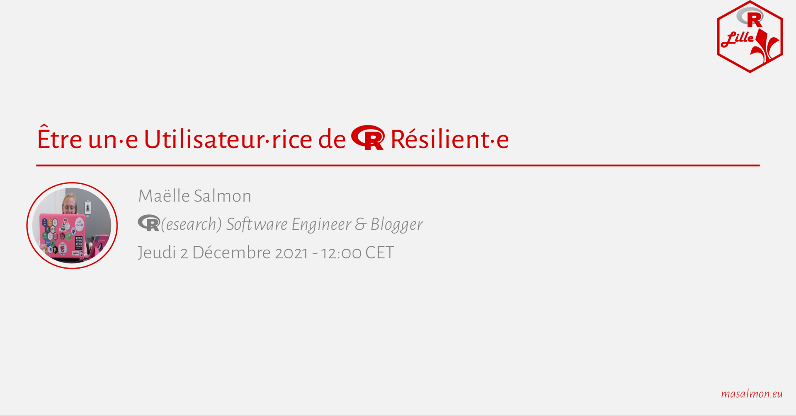

# R Lille Meetup Posters 

<!-- badges: start -->

<!-- badges: end -->

<table>
<tr>
<td align="center">
 <a href="meetups/2020-01-31">2020-01-31</a>
</td>
<td align="center">
 <a href="meetups/2020-10-07">2020-10-07</a>
</td>
<td align="center">
 <a href="meetups/2020-10-30">2020-10-30</a>
</td>
<td align="center">
 <a href="meetups/2021-02-17">2021-02-17</a>
</td>
</tr>
<tr>
<td align="center">
 <a href="meetups/2021-04-15">2021-04-15</a>
</td>
<td align="center">
 <a href="meetups/2021-04-29">2021-04-29</a>
</td>
<td align="center">
 <a href="meetups/2021-06-17">2021-06-17</a>
</td>
<td align="center">
 <a href="meetups/2021-11-18">2021-11-18</a>
</td>
</tr>
<tr>
<td align="center">
 <a href="meetups/2021-12-02">2021-12-02</a>
</td>
</tr>
</table>

*Note:* Poster/slides based on a template by [Mickaël
Canouil](https://mickael.canouil.fr/)
(<https://github.com/mcanouil/xaringan-template/>).
