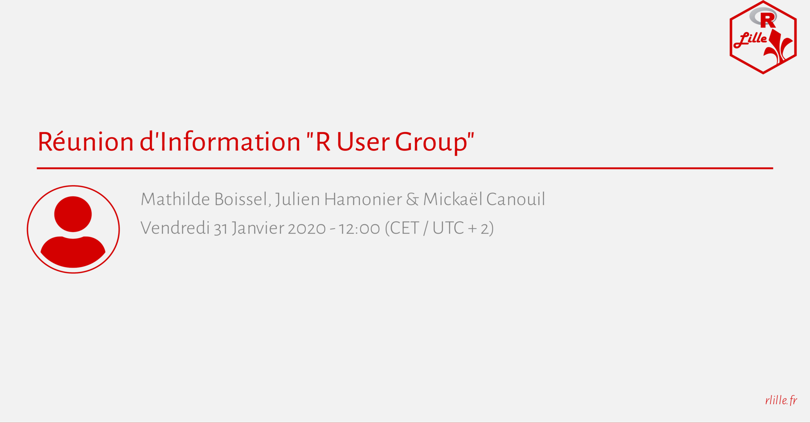
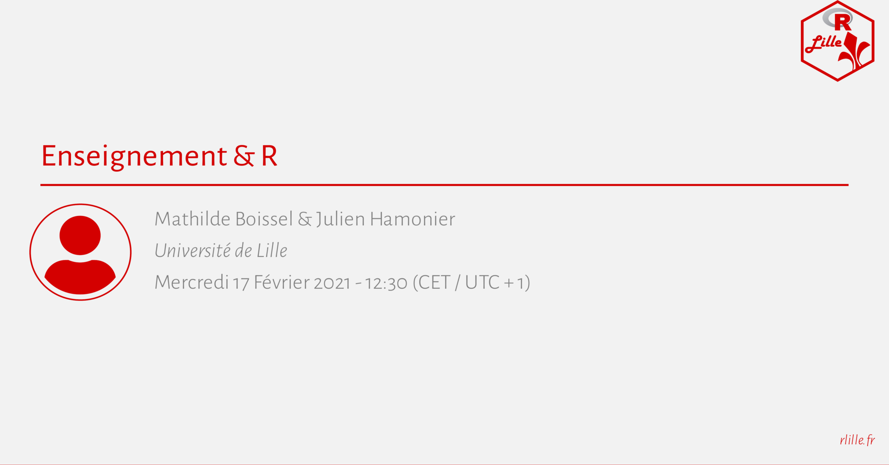

# R Lille Meetup Posters <a href="https://github.com/RLille/"></a>

<!-- badges: start -->

[](LICENSE)
<!-- badges: end -->

<table>
<tr>
<td align="center">
<a href="meetups/2020-01-31/materials/README.md"><br/>2020-01-31</a>
</td>
<td align="center">
<a href="meetups/2020-10-07/materials/README.md"><br/>2020-10-07</a>
</td>
<td align="center">
<a href="meetups/2020-10-30/materials/README.md"><br/>2020-10-30</a>
</td>
<td align="center">
<a href="meetups/2021-02-17/materials/README.md"><br/>2021-02-17</a>
</td>
</tr>
<tr>
<td align="center">
<a href="meetups/2021-04-15/materials/README.md"><br/>2021-04-15</a>
</td>
<td align="center">
<a href="meetups/2021-04-29/materials/README.md"><br/>2021-04-29</a>
</td>
<td align="center">
<a href="meetups/2021-06-17/materials/README.md"><br/>2021-06-17</a>
</td>
<td align="center">
<a href="meetups/2021-11-18/materials/README.md"><br/>2021-11-18</a>
</td>
</tr>
<tr>
<td align="center">
<a href="meetups/2021-12-02/materials/README.md"><br/>2021-12-02</a>
</td>
<td align="center">
<a href="meetups/2022-04-07/materials/README.md"><br/>2022-04-07</a>
</td>
</tr>
</table>

*Note:* Poster/slides based on a template by [Mickaël
Canouil](https://mickael.canouil.fr/)
(<https://github.com/mcanouil/xaringan-template/>).

## Submit A Meetup Proposal

To submit a meetup proposal, make a pull request (PR) which add a new R
script (in `./R`) as described below.  
The script must be named `20YY-MM-DD.R` where `YY` is the year, `MM` is
the month and `DD` is the day of the proposed meetup.  
The PR will be reviewed, modified (if needed), and validated by the R
Lille organisers.  
Once the PR is validated and merged, the MeetUp will be scheduled and
published on [rlille.fr](https://rlille.fr) and
[meetup.rlille.fr](http://meetup.rlille.fr).

``` r
# `R/20YY-MM-DD.R`
create_meetup(
  output = here::here("meetups/20YY-MM-DD"),
  rmd_params = list(
    title = "Title Of The Meetup", # title of the meetup
    author = "Firstname Lastname", # speaker
    institute = "", # speaker's institute/affiliation
    date = 'Thursday, the DD<sup><i style="font-size:0.5em;">th</i></sup> of MM, 20YY - 18:00 CET', # date of the meetup
    date_short = "20YY-MM-DD", # date of the meetup using YYYY-MM-DD format
    picture = "none", # URL of the speaker's picture, or "none"
    website = "", # URL of the speaker's website
    abstract = "", # abstract of the talk using Markdown syntax
    biography = "", # biography of the speaker using Markdown syntax
    language = "en", # language of the talk
    meetup_id = "" # to be filled by R Lille organisers
  )
)
```

*Note:* The date can be changed/updated after the PR is made.
